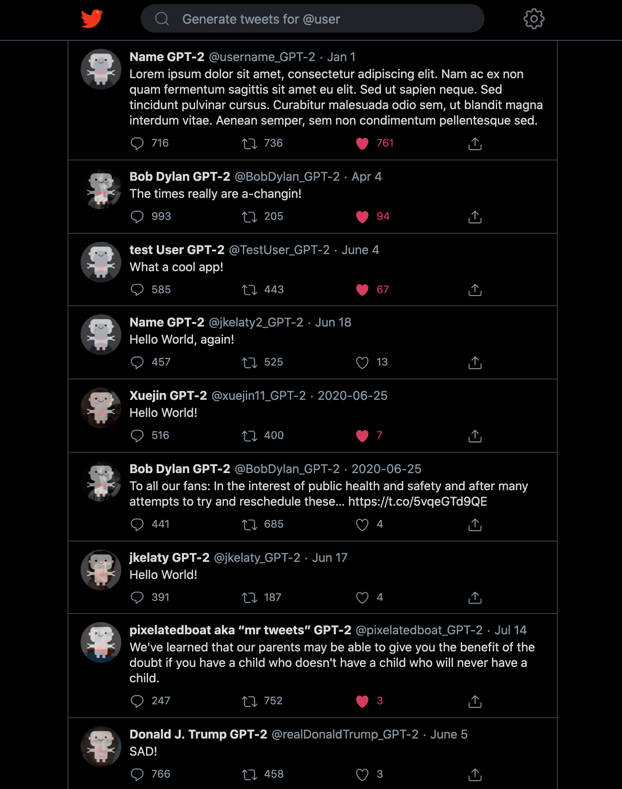
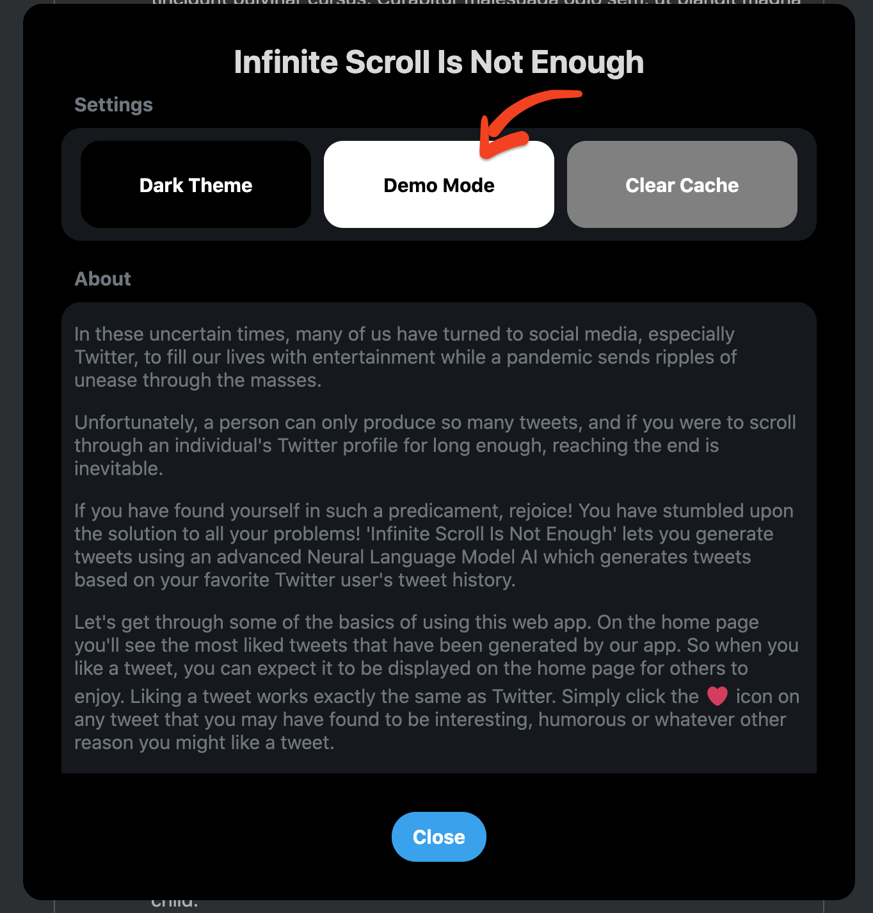
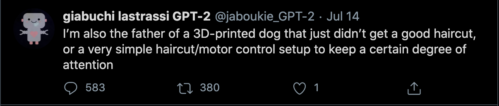

# Infinite Scroll Is Not Enough

Infinite Scroll Is Not Eough is a web app built to relieve the chronic unease one feels when you've scrolled a tad too far off the map and found yourself in Davy Jones' Locker - or you just ran out of interesting tweets to read. Either way, this is the app for you!

- Tweets are generated using **GPT-2**
- Frontend built using **Gatsby, ReactJS, Sass, GraphQL** and hosted on **GitHub Pages**
- Backend built using **Flask** and **PostgreSQL** and hosted on **Heroku** 
- 3rd-part APIs include **Twitter's API** and **[InferKit]**

[InferKit]: https://inferkit.com/

## Overview

- One of our primary goals we set out of achieve with this project was to recreate the Twitter experience as closely as possible. Meticulously picking through Twitter's styling seemingly paid off well enough since we were able to achieve an interface that very nearly resembles Twitter's UI, albeit without all the extra sidebars and a slightly different configuration. But the core experience, the tweets themselves, are nearly identical stylistically to what you'd find on Twitter.

    

- We also wanted to ensure that Tweets could be generated truly infinitely - that is of course the entire purpose of this app. In theory, this is possible, however due to financial constraints (and because this is just a school project), we don't intend to continuously run a server with GPUs to keep this app running, so you won't be able to actually generate tweets unless you clone this repo and host your own version. With that said, we have hardcoded some generated Tweets so you can still get a feel for intended experience. When 'Demo' mode is enabled on the demo site (see image below), try entering any of the following users in the search bar:
    - **@pixelatedboat**
    - **@danadonly**
    - **@jaboukie**
    - **@RachelMComedy**

    

- Lastly, we felt we should mention that we wanted to be as transparent as possible when displaying the generated Tweets to users. Each tweet will be clearly marked as a generated tweet with 'GPT-2' appended to both its handle and display name, as well as a robot icon emplaced over the profile image. We do not want to explicity nor implicitly portray any of the text generated as representative of the actual users who we are generating tweets for, since the model that was used to generate the text was trained on data from countless sources that will affect what the final output text is, regardless of the input prompt. 

    

## Demo

- A working demo of the site hosted on GitHub Pages can be accessed [here!]

[here!]: https://jkelaty.github.io/infinite-scroll-is-not-enough/

## Contributers

- Jonathan Kelaty
- Xuejin Gao
- Benjamin Pulatov
- Ka Ming Wong
